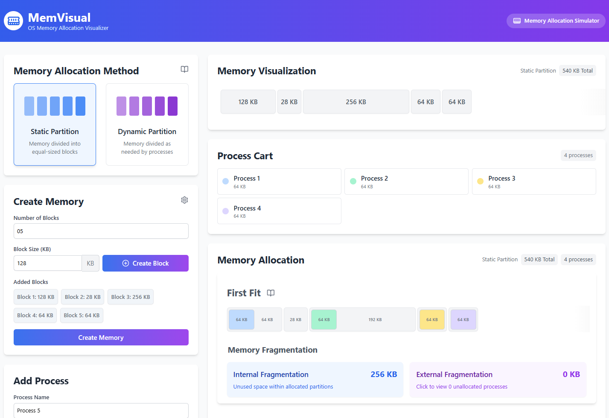

# 🧠 Memory Allocation Visualizer

A web-based tool to visualize how different memory allocation strategies (Fixed & Dynamic partitioning) work. Built for educational and demonstration purposes, this project helps users understand how operating systems manage memory.

🔗 **Live Site**: [mem-visual.vercel.app](https://mem-visual.vercel.app)


## 🖼️ Screenshot



---

## 📸 Features

- 📦 **Create Memory**  
  Define total memory size and choose between **Static Partitioning** (user-defined partitions) and **Dynamic Partitioning** (variable-sized blocks). Visual blocks represent each partition with adjustable sizes.

- 👨‍💻 **Create Processes**  
  Add processes dynamically at runtime by specifying their memory requirements. Processes can be added, removed, and reallocated to test allocation algorithms in real-time.

- ⚙️ **Allocation Strategies**  
  Visualize how different algorithms allocate memory:

  - 🥇 **First Fit**: Allocates the first block that is large enough.
  - 🧠 **Best Fit**: Finds the smallest sufficient block, minimizing waste.
  - 🧱 **Worst Fit**: Allocates to the largest block, preserving smaller ones.
  - 🔄 **Next Fit**: Continues searching from the last allocation point.

- 💡 **Fragmentation Visualization**

  - **Internal Fragmentation**: Shown when a process leaves unused space in a fixed partition.
  - **External Fragmentation**: Clearly displayed in dynamic partitions when unallocated memory is scattered and can't fit a process.

- 🎨 **Color-Coded Processes**

  - Each process is assigned a distinct, soft color.
  - Free memory and unallocated partitions are visually separated.

- 📊 **Visualization**

  - View allocated and fragmented memory blocks
  - Distinct colors for each process
  - Real-time feedback and process status

- 🌐 **Responsive Design**
  - Smooth experience across devices.
  - Horizontal scrolling with gradient fade effects for overflow blocks.

---

## 🛠️ Run Locally

Follow these steps to run the project locally:

1. Clone the project

   ```bash
     https://github.com/Kevin-Dobariyaa/MemVisual.git
     cd MemVisual
   ```

2. Install Dependencies

    Make sure you have Node.js (v16 or later) installed, then run:

    ```bash
      npm install
    ```

3. Start the Development Server

    ```bash
      npm run dev
    ```

    The app will be available at:
    `http://localhost:5173` to craft memory
 